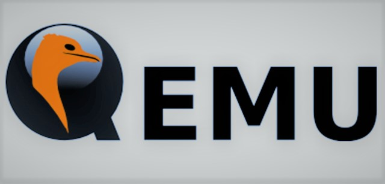

<p align="center">
  
</p>


**Cloud Computing** presentation at _Amirkabir University of Tehran, Iran_.


<br />


## What is QEMU?

**QEMU** is a generic and open source machine & userspace _Emulator_ and _Virtualizer_. 
It is capable of _emulating_ a complete machine in software without any
need for hardware virtualization support. 

By using dynamic translation, it achieves very good performance. It can also integrate with 
the Xen and KVM hypervisors to provide emulated hardware while allowing the hypervisor to manage the CPU. 
With hypervisor support, **QEMU** can achieve near native performance for CPUs.


<br />


## Why QEMU?

**QEMU** emulates the machine's processor through dynamic binary translation and provides a set of
different hardware and device models for the machine, enabling it to run a variety of guest operating systems.
It aims to fit into a variety of use cases. It can be invoked directly by users wishing to have full control over its behaviour and settings. 
It also aims to facilitate integration into higher level management layers, by providing a stable command line interface and monitor API.


<br />


## Executing QEMU on your local!

Clone into the presentation repository to access **QEMU** source codes:

```shell
git clone https://github.com/amirhnajafiz/QEMU
```

Go inside ```src``` directory and build **QEMU** by running the following commands:

```shell
cd src
../configure
make
```


<br />


## Additional Information

Additional information can also be found online via the QEMU website:

- [QEMU on Linux](https://www.qemu.org/download/#linux)
- [QEMU on Windows](https://www.qemu.org/download/#windows)
- [QEMU on MacOS](https://www.qemu.org/download/#macos)
