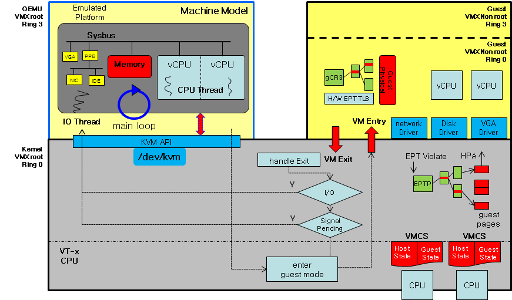
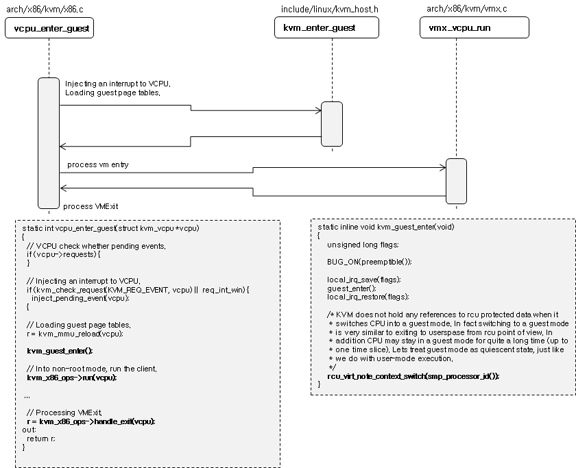
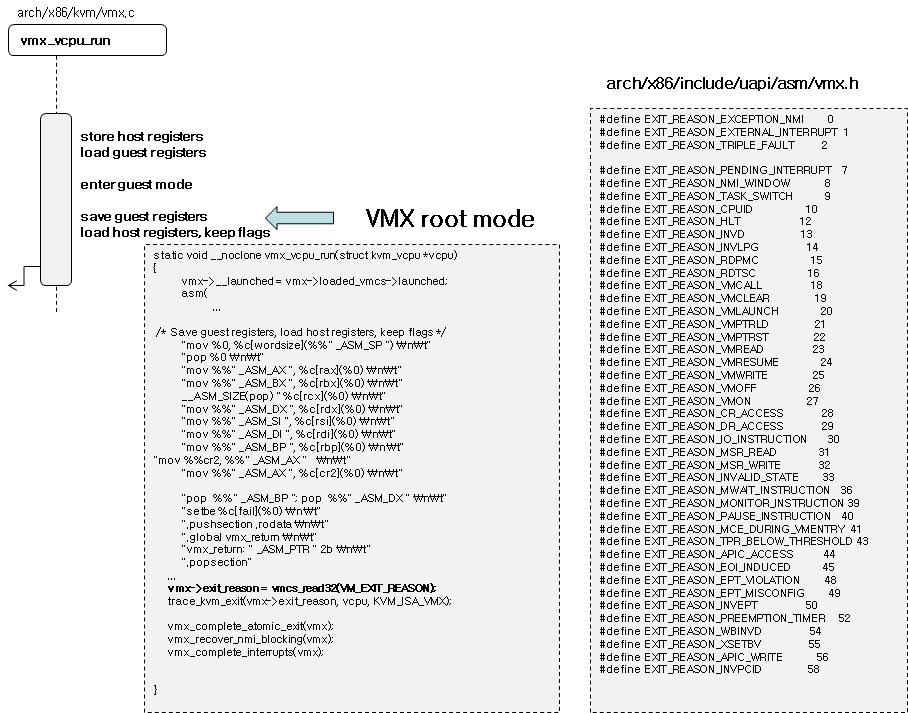

<p align="center">
  
</p>

<p align="center">
  <b>Cloud Computing</b> presentation at <i>Amirkabir University of Tehran, Iran</i><br />
  Cloud Computing Course Fall 2022-23<br />
  <b>Dr. Seyed Ahmad Javadi</b>
</p>

<br />

___

<br />

## What is QEMU?

**QEMU** is a generic and open source machine & userspace _Emulator_ and _Virtualizer_.
It is capable of _emulating_ a complete machine in software without any
need for hardware virtualization support.

By using dynamic translation, it achieves very good performance. It can also integrate with
the Xen and KVM hypervisors to provide emulated hardware while allowing the hypervisor to manage the CPU.
With hypervisor support, **QEMU** can achieve near native performance for CPUs.

<br />

## Why QEMU?

**QEMU** emulates the machine's processor through dynamic binary translation and provides a set of
different hardware and device models for the machine, enabling it to run a variety of guest operating systems.
It aims to fit into a variety of use cases. It can be invoked directly by users wishing to have full control over its behaviour and settings.
It also aims to facilitate integration into higher level management layers, by providing a stable command line interface and monitor API.

<br />

## QEMU architecture

Analysis of QEMU and KVM.

<p align="center">
  
</p>

### Notes

- KVM: Kernel-based Virtual Machine (KVM) is an open source virtualization technology built into Linux.
- VMCS: Virtual Machine Control Structure.

VM enter:

<p align="center">
  
</p>

VM exit:

<p align="center">
  
</p>

### qemu levels

QEMU does the emulation in the following levels:

- Device
- Memory
- CPU (our target)
- Network

<p align="center">
  
</p>

#### Question 1

<details>

<summary>
What is the type of **QEMU** hypervisor? (Type 1 or Type 2)
</summary>

**QEMU** by itself is a Type-2 hypervisor. It intercepts the instructions meant for Virtual CPU and uses the host operating system to get those instructions executed on the physical CPU.
When **QEMU** uses **KVM** for hardware acceleration, the combination becomes a Type-1 hypervisor.

</details>

### qemu main modules

#### Configs

A ```configure``` file will be created after you run the ```run.sh``` script. This file
contains all of the set up tools that **QEMU** needs. Version control, dependencies, build directories and ...

#### Plugins

In ```plugins``` directory there is a ```plugin.h``` file which contains data of plugins which you can set on
**QEMU**.

#### Block.c

In ```block.c``` file you can see all of the methods that are used to work with memory or storage.

### qemu CPU module

In ```cpu.c``` you can see methods and structs in order to emulate CPU. It contians structs like ```VMStateDescription```,
variables like ```cpu_common_props``` and methods like ```queue_work_on_cpu``` and ```do_run_on_cpu```, ```cpu_exec_start```.

For example, here is a block of code in ```cpus-common.c```:

```c
/* Wait for exclusive ops to finish, and begin cpu execution.  */
void cpu_exec_start(CPUState *cpu)
{
    /* Write cpu->running before reading pending_cpus.  */
    smp_mb();

    /* 1. start_exclusive saw cpu->running == true and pending_cpus >= 1.
     * After taking the lock we'll see cpu->has_waiter == true and run---not
     * for long because start_exclusive kicked us.  cpu_exec_end will
     * decrement pending_cpus and signal the waiter.
     *
     * 2. start_exclusive saw cpu->running == false but pending_cpus >= 1.
     * This includes the case when an exclusive item is running now.
     * Then we'll see cpu->has_waiter == false and wait for the item to
     * complete.
     *
     * 3. pending_cpus == 0.  Then start_exclusive is definitely going to
     * see cpu->running == true, and it will kick the CPU.
     */
    if (unlikely(qatomic_read(&pending_cpus))) {
        QEMU_LOCK_GUARD(&qemu_cpu_list_lock);
        if (!cpu->has_waiter) {
            /* Not counted in pending_cpus, let the exclusive item
             * run.  Since we have the lock, just set cpu->running to true
             * while holding it; no need to check pending_cpus again.
             */
            qatomic_set(&cpu->running, false);
            exclusive_idle();
            /* Now pending_cpus is zero.  */
            qatomic_set(&cpu->running, true);
        } else {
            /* Counted in pending_cpus, go ahead and release the
             * waiter at cpu_exec_end.
             */
        }
    }
}
```

#### Question 2

What will happen if ```cpu_exec_start``` returns nothing?. Like this:

```c
/* Wait for exclusive ops to finish, and begin cpu execution.  */
void cpu_exec_start(CPUState *cpu)
{
  return
}
```

#### Question 3

Why **Emulation**? Can we say it is **Simulation**?

<br />

## Executing QEMU on your local PC

Clone into the presentation repository to access **QEMU** source codes:

```shell
git clone https://github.com/amirhnajafiz/QEMU
```

Go inside ```src``` directory and build **QEMU** by running the following commands:

```shell
cd src
../configure
make
```

<br />

## QEMU vs VirtualBox

As discussed earlier, **QEMU** can be used for emulation and virtualization, however, **VirtualBox** can be used for virtualization only. QEMU comes with dual support of emulation and virtualization whereas the latter provides only virtualization features.

**QEMU/KVM** is better integrated in Linux, has a smaller footprint and should therefore be faster. **VirtualBox** is a virtualization software limited to x86 and amd64 architecture. Xen uses **QEMU** for the hardware assisted virtualization, but can also paravirtualize guests without hardware virtualisation

<br />

## Additional Information

Additional information can also be found online via the QEMU website:

- [QEMU on Linux](https://www.qemu.org/download/#linux)
- [QEMU on Windows](https://www.qemu.org/download/#windows)
- [QEMU on MacOS](https://www.qemu.org/download/#macos)

<br />

## Presentation Resources

- [QEMU website](https://www.qemu.org/)
- [QEMU documents](https://www.qemu.org/docs/master/)
- [QEMU Architecture](https://wiki.qemu.org/Documentation/Architecture)
- [GiantVM](https://github.com/GiantVM/QEMU)
- [How to build QEMU?](https://www.howtogeek.com/devops/how-to-use-qemu-to-boot-another-os/)
- [Virtualbox vs QEMU](https://linuxhint.com/qemu-vs-virtualbox/#:~:text=Key%20Differences%20between%20QEMU%20and,latter%20provides%20only%20virtualization%20features.)
