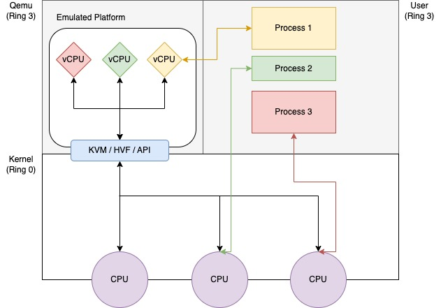

<p align="center">
  
</p>

<p align="center">
  <b>Cloud Computing</b> presentation at <i>Amirkabir University of Tehran, Iran</i><br />
  Cloud Computing Course Fall 2022-23<br />
  <b>Dr. Seyed Ahmad Javadi</b>
</p>

<br />

## What is QEMU?

**QEMU** is a generic and open source machine & userspace _Emulator_ and _Virtualizer_.
It is capable of _emulating_ a complete machine in software without any
need for hardware virtualization support.

By using dynamic translation, it achieves very good performance. It can also integrate with
the Xen and KVM hypervisors to provide emulated hardware while allowing the hypervisor to manage the CPU.
With hypervisor support, **QEMU** can achieve near native performance for CPUs.

<br />

### Question 1

<details>

<summary> What is the difference between emulation and virtualization? </summary>

<br />

<pre>
While emulated environments require a software bridge to interact with
the hardware, virtualization accesses hardware directly.
However, despite being the overall faster option, virtualization is limited to
running software that was already capable of running on the underlying hardware.
</pre>

</details>

<br />

## Why QEMU?

**QEMU** emulates the machine's processor through dynamic binary translation and provides a set of
different hardware and device models for the machine, enabling it to run a variety of guest operating systems.
It aims to fit into a variety of use cases. It can be invoked directly by users wishing to have full control over its behaviour and settings.
It also aims to facilitate integration into higher level management layers, by providing a stable command line interface and monitor API.

<br />
<br />

## QEMU architecture

Analysis of QEMU and KVM.

<p align="center">
  
</p>

### Notes

- KVM: Kernel-based Virtual Machine (KVM) is an open source virtualization technology built into Linux.

#### Quick Question

<details>

<summary> What are the Rings? </summary>

<pre>
Computers are often running multiple software processes at once,
and these will require differing levels of access to resources and hardware.
Operating systems can be broken down into a number of discrete layers,
each with its own privileges.
This system is known as a protection ring.

Code executing in ring 0 is said to be running in system space,
kernel mode or supervisor mode.
All other code such as applications running on the operating system
operates in less privileged rings, typically ring 3.
</pre>

</details>

<br />

### QEMU levels

QEMU does the emulation in the following levels:

- Device
- Memory
- CPU (our target)
- Network

<br />

#### Question 2

<details>

<summary> What is the type of QEMU hypervisor? (Type 1 or Type 2) </summary>

<br />

<pre>
QEMU by itself is a Type-2 hypervisor.
It intercepts the instructions meant for Virtual CPU and uses the
host operating system to get those instructions executed on the physical CPU.
When QEMU uses KVM for hardware acceleration,
the combination becomes a Type-1 hypervisor.
</pre>

</details>

<br />

### QEMU main modules

#### Configs

A ```configure``` file will be created after you run the ```run.sh``` script. This file
contains all of the set up tools that **QEMU** needs. Version control, dependencies, build directories and ...

<br />

#### Plugins

In ```plugins``` directory there is a ```plugin.h``` file which contains data of plugins which you can set on
**QEMU**.

<br />

<p align="center">
  
</p>

<br />

### QEMU CPU module

In ```cpu.c``` you can see methods and structs in order to emulate CPU. It contians structs like ```VMStateDescription```,
variables like ```cpu_common_props``` and methods like ```queue_work_on_cpu``` and ```do_run_on_cpu```, ```cpu_exec_start```.

For example, here is a block of code in ```cpus-common.c```:

```c
/* Wait for exclusive ops to finish, and begin cpu execution.  */
void cpu_exec_start(CPUState *cpu)
{
    /* Write cpu->running before reading pending_cpus.  */
    smp_mb();

    /* 1. start_exclusive saw cpu->running == true and pending_cpus >= 1.
     * After taking the lock we'll see cpu->has_waiter == true and run---not
     * for long because start_exclusive kicked us.  cpu_exec_end will
     * decrement pending_cpus and signal the waiter.
     *
     * 2. start_exclusive saw cpu->running == false but pending_cpus >= 1.
     * This includes the case when an exclusive item is running now.
     * Then we'll see cpu->has_waiter == false and wait for the item to
     * complete.
     *
     * 3. pending_cpus == 0.  Then start_exclusive is definitely going to
     * see cpu->running == true, and it will kick the CPU.
     */
    if (unlikely(qatomic_read(&pending_cpus))) {
        QEMU_LOCK_GUARD(&qemu_cpu_list_lock);
        if (!cpu->has_waiter) {
            /* Not counted in pending_cpus, let the exclusive item
             * run.  Since we have the lock, just set cpu->running to true
             * while holding it; no need to check pending_cpus again.
             */
            qatomic_set(&cpu->running, false);
            exclusive_idle();
            /* Now pending_cpus is zero.  */
            qatomic_set(&cpu->running, true);
        } else {
            /* Counted in pending_cpus, go ahead and release the
             * waiter at cpu_exec_end.
             */
        }
    }
}
```

<br />

#### Question 3

<details>

<summary> What will happen if cpu_exec_start returns nothing? Like this:

<br />

```c
/* Wait for exclusive ops to finish, and begin cpu execution.  */
void cpu_exec_start(CPUState *cpu)
{
  return
}
```

</summary>

<br />

<pre>
It's like creating process in your system, but you never
allow it to access CPU (it's always in ready state).
</pre>

</details>

<br />

#### Question 4

<details>

<summary> Why Emulation? Can we say it is Simulation? </summary>

<br />

<pre>
A simulator can perform tasks in abstract to demonstrate the behavior
of a thing and its components, while an emulator can copy
the behavior of that thing to functionally replace it.

In a sense, then, you can think of emulators as occupying a
middle ground between simulators and real devices.
Whereas simulators only mimic environment features that can be
configured or defined using software,
emulators mimic both hardware and software features.
</pre>

</details>

<br />
<br />

## Executing QEMU on your local PC

Clone into the presentation repository to access **QEMU** source codes:

```shell
git clone https://github.com/amirhnajafiz/QEMU
```

Go inside ```src``` directory and build **QEMU** by running the following commands:

```shell
cd src
../configure
make
```

Or run the following commands (execute ```run.sh```):

```shell
chmod +x ./run.sh
./run.sh
```

<br />

## CPU Plugged test

Let's go into [manual file](./Manual.md).

<br />

## Additional Information

Additional information can also be found online via the **QEMU** website:

- [QEMU on Linux](https://www.qemu.org/download/#linux)
- [QEMU on Windows](https://www.qemu.org/download/#windows)
- [QEMU on MacOS](https://www.qemu.org/download/#macos)

<br />

Some useful reports that I found for **QEMU**:

- [QEMU Static Analysis](https://www.researchgate.net/publication/257749022_QEMUCPC_static_analysis_and_CPS_conversion_for_safe_portable_and_efficient_coroutines)
- [QEMU Source Code Analysis](https://stackoverflow.com/questions/15485257/qemu-source-code-flow)

## Presentation Resources

- [QEMU website](https://www.qemu.org/)
- [QEMU documents](https://www.qemu.org/docs/master/)
- [QEMU Architecture](https://wiki.qemu.org/Documentation/Architecture)
- [GiantVM](https://github.com/GiantVM/QEMU)
- [How to build QEMU?](https://www.howtogeek.com/devops/how-to-use-qemu-to-boot-another-os/)
- [QEMU code call](https://stackoverflow.com/questions/20675226/qemu-code-flow-instruction-cache-and-tcg/21000294#21000294)
